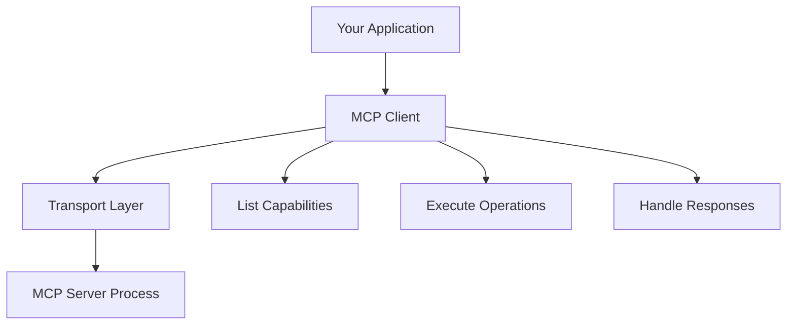

## What is an MCP Client?

An MCP client is an application that connects to MCP servers to access tools, resources, and prompts. Clients initiate the connection, discover available capabilities, and execute server operations.

## Client Architecture

A typical MCP client consists of:

1. **Transport** - Manages communication with the server (stdio, SSE, HTTP)
2. **Client Instance** - Handles protocol operations and capability discovery
3. **Application Logic** - Uses server capabilities to enhance functionality



## Creating a TypeScript Client

### Basic Client Setup

From `source/clients/basic-ts/src/index.ts:1-24`:

```typescript
import { Client } from "@modelcontextprotocol/sdk/client/index.js";
import { StdioClientTransport } from "@modelcontextprotocol/sdk/client/stdio.js";

// 1. Create transport
const transport = new StdioClientTransport({
  command: "node",
  args: ["path/to/server.js"]
});

// 2. Create client
const client = new Client(
  {
    name: "basic-client",
    version: "1.0.0"
  },
  {
    capabilities: {
      prompts: {},
      resources: {},
      tools: {}
    }
  }
);

// 3. Connect
await client.connect(transport);
```

### Reusable Client Class

For production use, create a reusable client class. From `source/clients/ollama-ts/src/mcpClient.ts:21-90`:

```typescript
export class MCPClient {
  private serverParams: {
    command: string;
    args: string[];
    env?: Record<string, string>;
  };
  private client: Client | null = null;
  private transport: StdioClientTransport | null = null;

  constructor(
    command: string,
    args: string[],
    env?: Record<string, string>
  ) {
    this.serverParams = { command, args, env };
  }

  async connect(): Promise<boolean> {
    try {
      // Create transport
      this.transport = new StdioClientTransport(this.serverParams);

      // Configure client
      this.client = new Client(
        {
          name: "mcp-typescript-client",
          version: "1.0.0"
        },
        {
          capabilities: {
            prompts: {},
            resources: {},
            tools: {}
          }
        }
      );

      // Connect to server
      await this.client.connect(this.transport);
      console.log("Connected to MCP server");
      return true;
    } catch (e) {
      console.error(`Connection error: ${e}`);
      await this.disconnect();
      return false;
    }
  }

  async disconnect(): Promise<void> {
    try {
      if (this.client) {
        await this.client.close();
        this.client = null;
      }
      this.transport = null;
      console.log("Disconnected from MCP server");
    } catch (e) {
      console.error(`Disconnect error: ${e}`);
    }
  }
}
```

## Creating a Python Client

### Basic Client Setup

From `source/clients/basic-py/main.py:1-16`:

```python
from mcp import ClientSession, StdioServerParameters
from mcp.client.stdio import stdio_client

# 1. Create server parameters
server_params = StdioServerParameters(
    command="node",
    args=["path/to/server.js"],
    env=None,
)

# 2. Connect and use
async def run():
    async with stdio_client(server_params) as (read, write):
        async with ClientSession(read, write) as session:
            await session.initialize()
            # Use session to call server capabilities
```

### Reusable Client Class

From `source/clients/ollama-py/mcp_client.py:9-70`:

```python
class MCPClient:
    def __init__(self, command: str, args: list[str], env: Optional[Dict[str, str]] = None):
        self.server_params = StdioServerParameters(
            command=command,
            args=args,
            env=env
        )
        self.session = None
        self._client_ctx = None
        self._session_ctx = None

    async def connect(self) -> bool:
        try:
            self._client_ctx = stdio_client(self.server_params)
            client = await self._client_ctx.__aenter__()
            self.read, self.write = client
            self._session_ctx = ClientSession(self.read, self.write)
            self.session = await self._session_ctx.__aenter__()
            await self.session.initialize()
            logger.info("Connected to MCP server")
            return True
        except Exception as e:
            logger.error(f"Connection error: {e}")
            await self.disconnect()
            return False

    async def disconnect(self) -> None:
        try:
            if self._session_ctx:
                await self._session_ctx.__aexit__(None, None, None)
            if self._client_ctx:
                await self._client_ctx.__aexit__(None, None, None)
            logger.info("Disconnected from MCP server")
        except Exception as e:
            logger.error(f"Disconnect error: {e}")

    async def __aenter__(self) -> 'MCPClient':
        success = await self.connect()
        if not success:
            raise RuntimeError("Failed to connect to MCP server")
        return self

    async def __aexit__(self, exc_type, exc_val, exc_tb) -> None:
        await self.disconnect()
```

## Discovering Server Capabilities

### Listing Available Capabilities

From `source/clients/basic-ts/src/index.ts:26-40`:

<CodeGroup>
```typescript TypeScript
// List prompts
const prompts = await client.listPrompts();
console.log(JSON.stringify(prompts, null, 2));

// List resources
const resources = await client.listResources();
console.log(JSON.stringify(resources, null, 2));

// List template resources
const templateResources = await client.listResourceTemplates();
console.log(JSON.stringify(templateResources, null, 2));

// List tools
const tools = await client.listTools();
console.log(JSON.stringify(tools, null, 2));
```

```python Python
# List prompts
prompts = await session.list_prompts()
print(prompts)

# List resources
resources = await session.list_resources()
print(resources)

# List template resources
template_resources = await session.list_resource_templates()
print(template_resources)

# List tools
tools = await session.list_tools()
print(tools)
```
</CodeGroup>

## Using Server Capabilities

### Calling Tools

From `source/clients/basic-ts/src/index.ts:69-78` and `source/clients/basic-py/main.py:58-66`:

<CodeGroup>
```typescript TypeScript
const tool = await client.callTool({
  name: "lcm",
  arguments: {
    numbers: [1, 2, 3, 4, 5]
  }
});
console.log("Tool result:");
console.log(JSON.stringify(tool, null, 2));
```

```python Python
tool_result = await session.call_tool(
    "lcm",
    arguments={
        "numbers": [1, 2, 3, 4, 5]
    },
)
print("Tool Result:")
print(tool_result)
```
</CodeGroup>

### Reading Resources

From `source/clients/basic-ts/src/index.ts:53-67` and `source/clients/basic-py/main.py:43-51`:

<CodeGroup>
```typescript TypeScript
// Read static resource
const resource = await client.readResource({
  uri: "got://quotes/random"
});
console.log("Resource fetched:");
console.log(JSON.stringify(resource, null, 2));

// Read dynamic resource
const templateResource = await client.readResource({
  uri: "person://properties/alexys"
});
console.log("Template resource fetched:");
console.log(JSON.stringify(templateResource, null, 2));
```

```python Python
# Read static resource
resource = await session.read_resource("got://quotes/random")
print("Resource:")
print(resource)

# Read dynamic resource
resource = await session.read_resource("person://properties/alexys")
print("Dynamic Resource:")
print(resource)
```
</CodeGroup>

### Getting Prompts

From `source/clients/basic-ts/src/index.ts:42-51` and `source/clients/basic-py/main.py:23-31`:

<CodeGroup>
```typescript TypeScript
const prompt = await client.getPrompt({
  name: "code_review",
  arguments: {
    code: "print('Hello, world!')"
  }
});
console.log("Prompt:");
console.log(JSON.stringify(prompt, null, 2));
```

```python Python
prompt = await session.get_prompt(
    "code_review",
    arguments={
        "code": "console.log('Hello, world!');"
    }
)
print("Prompt:")
print(prompt)
```
</CodeGroup>

## Client Wrapper for Enhanced Usability

Add convenience methods to your client class:

<CodeGroup>
```typescript TypeScript
export class MCPClient {
  // ... existing code ...

  async listTools(): Promise<any> {
    if (!this.client) {
      throw new Error("Not connected. Call connect() first");
    }
    try {
      const tools = await this.client.listTools();
      console.debug(`Available tools: ${JSON.stringify(tools)}`);
      return tools;
    } catch (e) {
      console.error(`Error listing tools: ${e}`);
      throw e;
    }
  }

  async executeTool(toolName: string, args: Record<string, any>): Promise<any> {
    if (!this.client) {
      throw new Error("Not connected. Call connect() first");
    }
    try {
      console.debug(`Executing tool ${toolName} with args: ${JSON.stringify(args)}`);
      const result = await this.client.callTool({
        name: toolName,
        arguments: args
      });
      console.debug(`Tool result: ${JSON.stringify(result)}`);
      return result;
    } catch (e) {
      console.error(`Error executing tool ${toolName}: ${e}`);
      throw e;
    }
  }
}
```

```python Python
class MCPClient:
    # ... existing code ...

    async def list_tools(self) -> Any:
        if not self.session:
            raise RuntimeError("Not connected. Call connect() first")
        try:
            tools = await self.session.list_tools()
            logger.debug(f"Available tools: {tools}")
            return tools
        except Exception as e:
            logger.error(f"Error listing tools: {e}")
            raise

    async def execute_tool(self, tool_name: str, arguments: Dict[str, Any]) -> Any:
        if not self.session:
            raise RuntimeError("Not connected. Call connect() first")
        try:
            logger.debug(f"Executing tool {tool_name} with args: {arguments}")
            result = await self.session.call_tool(tool_name, arguments)
            logger.debug(f"Tool result: {result}")
            return result
        except Exception as e:
            logger.error(f"Error executing tool {tool_name}: {e}")
            raise
```
</CodeGroup>

## Error Handling

### Connection Errors

```typescript
try {
  await client.connect(transport);
} catch (e) {
  if (e instanceof Error) {
    if (e.message.includes("connect")) {
      console.error(`Connection error: ${e}`);
    } else {
      console.error(`Unknown error: ${e}`);
    }
  }
  await client.close();
}
```

### Operation Errors

```python
try:
    result = await session.call_tool("tool_name", arguments={...})
except Exception as e:
    logger.error(f"Tool execution failed: {e}")
    raise
```

## Client Lifecycle Management

### Using Context Managers

<CodeGroup>
```typescript TypeScript
// Manual lifecycle
const client = new MCPClient("node", ["server.js"]);
try {
  await client.connect();
  const tools = await client.listTools();
  // ... use client ...
} finally {
  await client.disconnect();
}
```

```python Python
# Python context manager (recommended)
async with MCPClient("node", ["server.js"]) as client:
    tools = await client.list_tools()
    # ... use client ...
# Automatically disconnects
```
</CodeGroup>

## Best Practices

<AccordionGroup>
  <Accordion title="Always Close Connections">
    Ensure you disconnect from servers to avoid resource leaks:
    
    ```typescript
    try {
      await client.connect(transport);
      // ... use client ...
    } finally {
      await client.close();
    }
    ```
  </Accordion>
  
  <Accordion title="Handle Connection Failures">
    Always handle connection failures gracefully:
    
    ```python
    async def connect(self) -> bool:
        try:
            # connection logic
            return True
        except Exception as e:
            logger.error(f"Connection failed: {e}")
            await self.disconnect()
            return False
    ```
  </Accordion>
  
  <Accordion title="Validate Capabilities">
    Check that the server supports required capabilities before using them:
    
    ```typescript
    const tools = await client.listTools();
    if (!tools.tools.find(t => t.name === "required_tool")) {
      throw new Error("Server doesn't support required_tool");
    }
    ```
  </Accordion>
  
  <Accordion title="Use Type Safety">
    Leverage TypeScript types or Python type hints for better code quality:
    
    ```typescript
    async executeTool<T>(name: string, args: Record<string, any>): Promise<T> {
      const result = await this.client.callTool({ name, arguments: args });
      return result as T;
    }
    ```
  </Accordion>
</AccordionGroup>

<Tip>
  For AI applications, integrate MCP clients into your agent loop to dynamically discover and use server capabilities.
</Tip>

## Next Steps

<CardGroup cols={2}>
  <Card title="Tools" icon="wrench" href="/concepts/tools">
    Learn how tools work and how to use them effectively
  </Card>
  
  <Card title="Resources" icon="database" href="/concepts/resources">
    Understand how to read and use server resources
  </Card>
  
  <Card title="Prompts" icon="message" href="/concepts/prompts">
    Discover how to use prompts in your applications
  </Card>
  
  <Card title="Build a Server" icon="server" href="/concepts/servers">
    Create your own MCP server
  </Card>
</CardGroup>