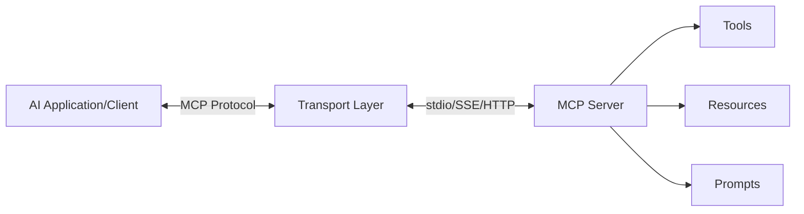

## What is MCP?

The **Model Context Protocol (MCP)** is a standardized protocol for communication between AI applications (clients) and context providers (servers). It enables AI models to securely access external data sources, tools, and capabilities through a uniform interface.

## Protocol Architecture

MCP follows a client-server architecture where:

- **Servers** expose capabilities (tools, resources, prompts)
- **Clients** consume these capabilities to enhance AI interactions
- **Transport** handles the communication layer between client and server



## Communication Patterns

### Request-Response Pattern

MCP uses a request-response pattern for most operations:

1. Client sends a request message
2. Server processes the request
3. Server sends a response message
4. Client receives and handles the response

### Message Types

MCP defines several core message types:

#### Initialization Messages

- `initialize` - Client initiates connection with server
- `initialized` - Server confirms successful initialization

#### Capability Discovery

- `tools/list` - Request list of available tools
- `resources/list` - Request list of available resources
- `prompts/list` - Request list of available prompts
- `resources/templates/list` - Request list of resource templates

#### Execution Messages

- `tools/call` - Execute a specific tool
- `resources/read` - Read a specific resource
- `prompts/get` - Get a specific prompt with arguments

#### Response Format

All responses follow a consistent structure with content arrays:

```json
{
  "content": [
    {
      "type": "text",
      "text": "Response data"
    }
  ],
  "isError": false
}
```

## Stdio Transport Mechanism

The most common transport mechanism in MCP is **stdio** (standard input/output), which enables:

- **Process-based isolation** - Each server runs as a separate process
- **Simple deployment** - No network configuration required
- **Language agnostic** - Any language that supports stdio can implement MCP
- **Secure by default** - Communication stays on the local machine

### How Stdio Transport Works

<Steps>
  <Step title="Server Launch">
    Client spawns the server process with a command (e.g., `node server.js` or `python server.py`)
  </Step>
  
  <Step title="Connection Establishment">
    Client connects to the server's stdin/stdout streams
  </Step>
  
  <Step title="Message Exchange">
    Messages are sent as JSON-RPC formatted strings through stdin/stdout
  </Step>
  
  <Step title="Cleanup">
    Client closes connection and terminates server process when done
  </Step>
</Steps>

### TypeScript Stdio Transport Example

From `source/servers/basic/src/server.ts:298-300`:

```typescript
async function main() {
  const transport = new StdioServerTransport();
  await server.connect(transport);
}
```

### Python Stdio Transport Example

From `source/servers/calculator-py/server.py:32-33`:

```python
if __name__ == "__main__":
    mcp.run(transport='stdio')
```

## Server Capabilities

Servers declare their capabilities during initialization:

```typescript
const server = new McpServer({
  name: "Game of Thrones Quotes",
  version: "1.0.0",
  capabilities: {
    resources: { listChanged: true },
    tools: {},
    prompts: {}
  }
});
```

This tells clients which features the server supports:

- `tools` - Server can execute operations
- `resources` - Server can provide data
- `prompts` - Server can generate prompt templates
- `listChanged` - Server can notify when lists change

## Client Capabilities

Clients also declare capabilities when connecting:

```typescript
const client = new Client(
  {
    name: "basic-client",
    version: "1.0.0"
  },
  {
    capabilities: {
      prompts: {},
      resources: {},
      tools: {}
    }
  }
);
```

This negotiation ensures both sides support the required features for communication.

## Protocol Flow Example

Here's a complete flow of a client calling a tool:

<CodeGroup>
```typescript TypeScript Client
// 1. Create transport and client
const transport = new StdioClientTransport({
  command: "node",
  args: ["server.js"]
});

const client = new Client({ name: "client", version: "1.0.0" });

// 2. Connect
await client.connect(transport);

// 3. List available tools
const tools = await client.listTools();

// 4. Call a tool
const result = await client.callTool({
  name: "get_random_quotes",
  arguments: { count: 3 }
});
```

```python Python Client
# 1. Create server parameters
server_params = StdioServerParameters(
    command="node",
    args=["server.js"]
)

# 2. Connect and initialize session
async with stdio_client(server_params) as (read, write):
    async with ClientSession(read, write) as session:
        await session.initialize()
        
        # 3. List available tools
        tools = await session.list_tools()
        
        # 4. Call a tool
        result = await session.call_tool(
            "get_random_quotes",
            arguments={"count": 3}
        )
```
</CodeGroup>

<Note>
  The MCP protocol ensures type safety and validation at both the client and server level, making integrations reliable and predictable.
</Note>

## Next Steps

<CardGroup cols={2}>
  <Card title="MCP Servers" icon="server" href="/concepts/servers">
    Learn how to create and configure MCP servers
  </Card>
  
  <Card title="MCP Clients" icon="laptop" href="/concepts/clients">
    Discover how to build clients that connect to MCP servers
  </Card>
  
  <Card title="Tools" icon="wrench" href="/concepts/tools">
    Understand how to implement tools in your servers
  </Card>
  
  <Card title="Resources" icon="database" href="/concepts/resources">
    Explore how to provide data through resources
  </Card>
</CardGroup>