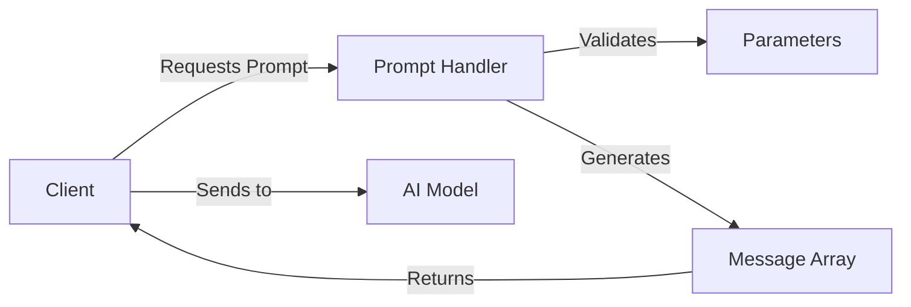

## What are Prompts?

In MCP, **prompts** are reusable templates that generate structured messages for AI interactions. They allow servers to:

- Provide pre-configured conversation starters
- Create specialized analysis workflows
- Inject context and instructions for AI models
- Standardize common AI interaction patterns

Prompts are **dynamic templates** that can accept parameters to customize the generated messages.

## Prompt Structure

Every MCP prompt consists of:

1. **Name** - Unique identifier for the prompt
2. **Parameters** - Input schema for customization (optional)
3. **Handler** - Generates the prompt messages
4. **Messages** - Array of message objects with roles and content



## Defining Prompts in TypeScript

### Basic Prompt

From `source/servers/basic/src/server.ts:259-294`:

```typescript
import { z } from "zod";

server.prompt(
  "code_review",                    // Prompt name
  { code: z.string() },             // Parameters schema
  async ({ code }) => {             // Handler function
    if (!code) {
      throw new Error("No code provided for review");
    }

    return {
      description: "Code Review",
      messages: [
        {
          role: "assistant",
          content: {
            type: "text",
            text: "You are an expert software engineer with extensive experience in code review. You will help review code with a focus on:" +
              "\n- Code quality and best practices" +
              "\n- Performance considerations" +
              "\n- Security implications" +
              "\n- Maintainability and readability" +
              "\n- Potential bugs or edge cases" +
              "\nPlease share the code you would like me to review."
          }
        },
        {
          role: "user",
          content: {
            type: "text",
            text: `Please review the following code and provide detailed feedback:\n\n${code}`
          }
        }
      ]
    };
  }
);
```

### Prompt with Optional Parameters

From `source/servers/basic/src/server.ts:214-257`:

```typescript
server.prompt(
  "got_quotes_analysis",
  { theme: z.string().optional() },     // Optional parameter
  async ({ theme }) => {
    try {
      // Fetch data for the prompt
      const quotes = await fetchRandomQuotes(5);
      const formattedQuotes = quotes.map(formatQuote);
      const quotesText = formattedQuotes.join("\n---\n");

      // Create conditional instruction
      const themeInstruction = theme
        ? ` Focus your analysis on the theme of '${theme}'.`
        : "";

      const systemContent =
        `You are an expert on Game of Thrones. Analyze these quotes and provide insights about the characters and their motivations.${themeInstruction}`;

      return {
        description: "Game of Thrones Quotes Analysis",
        messages: [
          {
            role: "assistant",
            content: {
              type: "text",
              text: systemContent
            }
          },
          {
            role: "user",
            content: {
              type: "text",
              text: `Here are some Game of Thrones quotes to analyze:\n\n${quotesText}`
            }
          }
        ]
      };
    } catch (error) {
      throw new Error(`Error generating quotes analysis prompt: ${(error as Error).message}`);
    }
  }
);
```

## Message Roles

Prompts return an array of messages with different roles:

### Assistant Role

Sets the context and instructions for the AI:

```typescript
{
  role: "assistant",
  content: {
    type: "text",
    text: "You are an expert software engineer..."
  }
}
```

### User Role

Provides the actual query or request:

```typescript
{
  role: "user",
  content: {
    type: "text",
    text: `Please analyze this code: ${code}`
  }
}
```

### System Role

Provides high-level instructions (supported by some models):

```typescript
{
  role: "system",
  content: {
    type: "text",
    text: "You are a helpful AI assistant specialized in code review."
  }
}
```

## Using Prompts from Clients

### Getting a Prompt

From `source/clients/basic-ts/src/index.ts:42-51` and `source/clients/basic-py/main.py:23-31`:

<CodeGroup>
```typescript TypeScript
// Get prompt with parameters
const prompt = await client.getPrompt({
  name: "code_review",
  arguments: {
    code: "print('Hello, world!')"
  }
});
console.log(JSON.stringify(prompt, null, 2));
```

```python Python
# Get prompt with parameters
prompt = await session.get_prompt(
    "code_review",
    arguments={
        "code": "console.log('Hello, world!');"
    }
)
print(prompt)
```
</CodeGroup>

### Listing Available Prompts

<CodeGroup>
```typescript TypeScript
const prompts = await client.listPrompts();
console.log(prompts);
// Output: { prompts: [{ name: "code_review", ... }, { name: "got_quotes_analysis", ... }] }
```

```python Python
prompts = await session.list_prompts()
print(prompts)
```
</CodeGroup>

### Using Prompt Messages with AI Models

```typescript
// Get prompt
const prompt = await client.getPrompt({
  name: "code_review",
  arguments: { code: myCode }
});

// Send messages to AI model
const aiResponse = await aiModel.chat({
  messages: prompt.messages.map(msg => ({
    role: msg.role,
    content: msg.content.text
  }))
});
```

## Prompt Response Format

Prompts return a structured response:

```typescript
return {
  description: "Human-readable description",
  messages: [
    {
      role: "assistant" | "user" | "system",
      content: {
        type: "text",
        text: "Message content"
      }
    }
  ]
};
```

## Real-World Prompt Examples

### Code Review Prompt

Structured code analysis with best practices:

```typescript
server.prompt(
  "code_review",
  { code: z.string() },
  async ({ code }) => {
    return {
      description: "Code Review",
      messages: [
        {
          role: "assistant",
          content: {
            type: "text",
            text: "You are an expert software engineer. Review code for:" +
                  "\n- Quality and best practices" +
                  "\n- Performance" +
                  "\n- Security" +
                  "\n- Maintainability" +
                  "\n- Bugs and edge cases"
          }
        },
        {
          role: "user",
          content: {
            type: "text",
            text: `Review this code:\n\n${code}`
          }
        }
      ]
    };
  }
);
```

### Analysis with Dynamic Data

Fetching external data to include in the prompt:

```typescript
server.prompt(
  "got_quotes_analysis",
  { theme: z.string().optional() },
  async ({ theme }) => {
    // Fetch data for context
    const quotes = await fetchRandomQuotes(5);
    const quotesText = quotes.map(formatQuote).join("\n---\n");
    
    // Build conditional instructions
    const themeInstruction = theme 
      ? ` Focus on the theme of '${theme}'.` 
      : "";

    return {
      description: "Game of Thrones Quotes Analysis",
      messages: [
        {
          role: "assistant",
          content: {
            type: "text",
            text: `Analyze Game of Thrones quotes.${themeInstruction}`
          }
        },
        {
          role: "user",
          content: {
            type: "text",
            text: `Analyze these quotes:\n\n${quotesText}`
          }
        }
      ]
    };
  }
);
```

### Multi-Step Conversation Starter

```typescript
server.prompt(
  "debug_session",
  { 
    error: z.string(),
    stackTrace: z.string().optional(),
    context: z.string().optional()
  },
  async ({ error, stackTrace, context }) => {
    return {
      description: "Interactive Debugging Session",
      messages: [
        {
          role: "assistant",
          content: {
            type: "text",
            text: "I'll help you debug this error. I'll analyze the error message, stack trace, and context to identify the root cause and suggest solutions."
          }
        },
        {
          role: "user",
          content: {
            type: "text",
            text: `Error: ${error}` +
                  (stackTrace ? `\n\nStack Trace:\n${stackTrace}` : "") +
                  (context ? `\n\nContext:\n${context}` : "")
          }
        }
      ]
    };
  }
);
```

## Advanced Patterns

### Prompts with Resource Data

Combine prompts with resource data:

```typescript
server.prompt(
  "analyze_user_data",
  { userId: z.string() },
  async ({ userId }) => {
    // Fetch user data (could also use a resource)
    const userData = await getUserData(userId);
    
    return {
      description: "User Data Analysis",
      messages: [
        {
          role: "assistant",
          content: {
            type: "text",
            text: "I'll analyze this user's data and provide insights."
          }
        },
        {
          role: "user",
          content: {
            type: "text",
            text: `Analyze this user data:\n\n${JSON.stringify(userData, null, 2)}`
          }
        }
      ]
    };
  }
);
```

### Contextual Prompts

Include system information or configuration:

```typescript
server.prompt(
  "deployment_advisor",
  { 
    environment: z.enum(["development", "staging", "production"]),
    changes: z.string()
  },
  async ({ environment, changes }) => {
    const envConfig = await getEnvironmentConfig(environment);
    
    return {
      description: "Deployment Advisor",
      messages: [
        {
          role: "assistant",
          content: {
            type: "text",
            text: `You are a DevOps expert. Advise on deploying to ${environment} environment with these constraints: ${JSON.stringify(envConfig)}`
          }
        },
        {
          role: "user",
          content: {
            type: "text",
            text: `Should I deploy these changes?\n\n${changes}`
          }
        }
      ]
    };
  }
);
```

## Best Practices

<AccordionGroup>
  <Accordion title="Provide Clear Instructions">
    Make assistant messages clear and specific:
    
    ```typescript
    {
      role: "assistant",
      content: {
        type: "text",
        text: "You are an expert code reviewer. Focus on:\n" +
              "- Security vulnerabilities\n" +
              "- Performance issues\n" +
              "- Best practices"
      }
    }
    ```
  </Accordion>
  
  <Accordion title="Use Parameters for Flexibility">
    Allow customization through parameters:
    
    ```typescript
    server.prompt(
      "analyze",
      { 
        data: z.string(),
        focus: z.string().optional(),
        depth: z.enum(["brief", "detailed"]).default("brief")
      },
      async ({ data, focus, depth }) => { ... }
    );
    ```
  </Accordion>
  
  <Accordion title="Validate Parameters">
    Always validate and handle missing required parameters:
    
    ```typescript
    async ({ code }) => {
      if (!code) {
        throw new Error("No code provided for review");
      }
      // ... continue
    }
    ```
  </Accordion>
  
  <Accordion title="Structure Multi-Turn Conversations">
    Use multiple messages to set up complex interactions:
    
    ```typescript
    messages: [
      { role: "assistant", content: { type: "text", text: "System instructions" } },
      { role: "user", content: { type: "text", text: "Initial query" } }
    ]
    ```
  </Accordion>
  
  <Accordion title="Include Relevant Context">
    Fetch and include data that helps the AI provide better responses:
    
    ```typescript
    const quotes = await fetchRandomQuotes(5);
    const quotesText = quotes.map(formatQuote).join("\n---\n");
    
    // Include in prompt
    text: `Analyze these quotes:\n\n${quotesText}`
    ```
  </Accordion>
</AccordionGroup>

## Prompts vs Tools vs Resources

<CardGroup cols={3}>
  <Card title="Use Prompts For" icon="message">
    - Conversation starters
    - Analysis workflows
    - AI instructions
    - Templated queries
  </Card>
  
  <Card title="Use Tools For" icon="wrench">
    - Actions
    - Calculations
    - Side effects
    - Computations
  </Card>
  
  <Card title="Use Resources For" icon="database">
    - Read-only data
    - Context information
    - Files/documents
    - Static content
  </Card>
</CardGroup>

## Testing Prompts

Test your prompts with different parameters:

```typescript
// Connect to server
const client = new Client(...);
await client.connect(transport);

// List available prompts
const prompts = await client.listPrompts();
console.log("Available prompts:", prompts);

// Test prompt with parameters
const prompt = await client.getPrompt({
  name: "code_review",
  arguments: {
    code: "function add(a, b) { return a + b; }"
  }
});

console.log("Generated prompt:");
prompt.messages.forEach(msg => {
  console.log(`[${msg.role}]: ${msg.content.text}`);
});
```

<Tip>
  Test your prompts with various parameter combinations to ensure they generate appropriate messages for all use cases.
</Tip>

## Next Steps

<CardGroup cols={2}>
  <Card title="Tools" icon="wrench" href="/concepts/tools">
    Learn how to implement executable tools
  </Card>
  
  <Card title="Resources" icon="database" href="/concepts/resources">
    Discover how to provide data through resources
  </Card>
  
  <Card title="Servers" icon="server" href="/concepts/servers">
    Build complete MCP servers with all capabilities
  </Card>
  
  <Card title="Clients" icon="laptop" href="/concepts/clients">
    Create clients that use prompts effectively
  </Card>
</CardGroup>