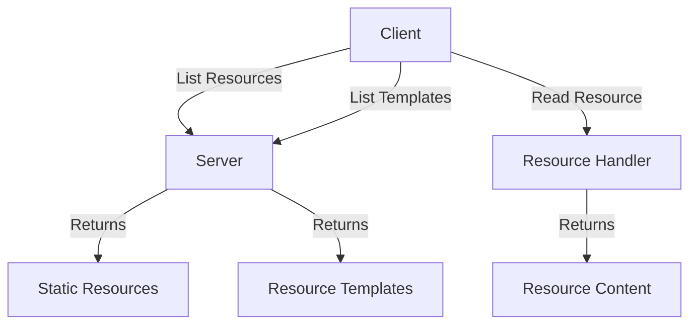

## What are Resources?

In MCP, **resources** are data sources that servers expose to clients. Unlike tools (which perform actions), resources provide **read-only access** to information.

Resources are ideal for:

- Providing contextual data to AI models
- Exposing database records
- Sharing configuration data
- Serving files or documents
- Delivering API responses

## Resource Types

MCP supports two types of resources:

### 1. Static Resources

Static resources have **fixed URIs** and are listed in `resources/list`:

```typescript
// Static resource: got://quotes/random
server.resource(
  "random-quotes",
  "got://quotes/random",
  async (uri) => { ... }
);
```

### 2. Dynamic Resources (Templates)

Dynamic resources use **URI templates** with variables, listed in `resources/templates/list`:

```typescript
// Dynamic resource: person://properties/{name}
server.resource(
  "person-properties",
  new ResourceTemplate("person://properties/{name}", { list: undefined }),
  async (uri, { name }) => { ... }
);
```



## Defining Static Resources

### Basic Static Resource

From `source/servers/basic/src/server.ts:142-164`:

```typescript
import { McpServer } from "@modelcontextprotocol/sdk/server/mcp.js";

server.resource(
  "random-quotes",               // Resource name
  "got://quotes/random",         // Static URI
  async (uri) => {                // Handler function
    try {
      // Fetch 5 random quotes
      const quotes = await fetchRandomQuotes(5);
      const formattedQuotes = quotes.map(formatQuote);

      return {
        contents: [{
          uri: uri.href,
          text: formattedQuotes.join("\n---\n"),
          mimeType: "text/plain"
        }]
      };
    } catch (error) {
      throw new Error(`Error fetching quotes: ${(error as Error).message}`);
    }
  }
);
```

### Resource Response Format

Resources return an array of content objects:

```typescript
return {
  contents: [
    {
      uri: uri.href,              // The resource URI
      text: "Resource data",      // The actual content (or blob for binary)
      mimeType: "text/plain"      // Content type
    }
  ]
};
```

## Defining Dynamic Resources

### Resource Templates

From `source/servers/basic/src/server.ts:166-211`:

```typescript
import { ResourceTemplate } from "@modelcontextprotocol/sdk/server/mcp.js";

// Define data structure
type PersonData = {
  name: string;
  age: number;
  height: number;
}

const personData: Record<string, PersonData> = {
  alexys: {
    name: "alexys",
    age: 23,
    height: 1.7
  },
  mariana: {
    name: "mariana",
    age: 23,
    height: 1.7
  }
};

server.resource(
  "person-properties",
  new ResourceTemplate("person://properties/{name}", { list: undefined }),
  async (uri, { name }) => {
    try {
      // Validate parameter
      if (!name || Array.isArray(name)) {
        throw new Error("name must be a single string");
      }

      // Fetch data
      const person = personData[name];
      if (!person) {
        throw new Error(`Person with name ${name} not found`);
      }

      return {
        contents: [{
          uri: uri.href,
          text: JSON.stringify(person),
          mimeType: "application/json"
        }]
      };
    } catch (error) {
      throw new Error(`Error fetching person data: ${(error as Error).message}`);
    }
  }
);
```

### URI Template Syntax

URI templates use curly braces for variables:

```typescript
"person://properties/{name}"              // Single variable
"files://documents/{category}/{id}"       // Multiple variables
"api://users/{userId}/posts/{postId}"     // Nested structure
```

## Reading Resources from Clients

### Reading Static Resources

From `source/clients/basic-ts/src/index.ts:53-59` and `source/clients/basic-py/main.py:43-46`:

<CodeGroup>
```typescript TypeScript
const resource = await client.readResource({
  uri: "got://quotes/random"
});
console.log("Resource fetched:");
console.log(JSON.stringify(resource, null, 2));
```

```python Python
resource = await session.read_resource("got://quotes/random")
print("Resource:")
print(resource)
```
</CodeGroup>

### Reading Dynamic Resources

From `source/clients/basic-ts/src/index.ts:61-67` and `source/clients/basic-py/main.py:48-51`:

<CodeGroup>
```typescript TypeScript
const templateResource = await client.readResource({
  uri: "person://properties/alexys"
});
console.log("Template resource fetched:");
console.log(JSON.stringify(templateResource, null, 2));
```

```python Python
resource = await session.read_resource("person://properties/alexys")
print("Dynamic Resource:")
print(resource)
```
</CodeGroup>

### Discovering Available Resources

<CodeGroup>
```typescript TypeScript
// List static resources
const resources = await client.listResources();
console.log(resources);
// Output: { resources: [{ uri: "got://quotes/random", name: "random-quotes", ... }] }

// List resource templates
const templates = await client.listResourceTemplates();
console.log(templates);
// Output: { resourceTemplates: [{ uriTemplate: "person://properties/{name}", ... }] }
```

```python Python
# List static resources
resources = await session.list_resources()
print(resources)

# List resource templates
template_resources = await session.list_resource_templates()
print(template_resources)
```
</CodeGroup>

## Content Types

### Text Content

Most common for JSON, plain text, or formatted data:

```typescript
return {
  contents: [{
    uri: uri.href,
    text: JSON.stringify(data),
    mimeType: "application/json"
  }]
};
```

### Binary Content

For images, PDFs, or other binary data:

```typescript
return {
  contents: [{
    uri: uri.href,
    blob: base64EncodedData,
    mimeType: "image/png"
  }]
};
```

### Common MIME Types

- `text/plain` - Plain text
- `application/json` - JSON data
- `text/html` - HTML content
- `text/markdown` - Markdown
- `image/png`, `image/jpeg` - Images
- `application/pdf` - PDF documents

## Resource vs Tool: When to Use Which?

<AccordionGroup>
  <Accordion title="Use Resources When...">
    - You're providing **read-only data**
    - The data is **contextual information** for AI models
    - You want to expose **files or documents**
    - The operation has **no side effects**
    
    Examples:
    - Configuration files
    - Database records (read-only)
    - API responses (read-only)
    - Documentation
  </Accordion>
  
  <Accordion title="Use Tools When...">
    - You're performing **actions or computations**
    - The operation has **side effects** (create, update, delete)
    - You need to **execute logic** based on inputs
    - The result depends on **complex processing**
    
    Examples:
    - Calculations
    - CRUD operations
    - External API calls that modify data
    - File operations (write, delete)
  </Accordion>
</AccordionGroup>

## Resource Best Practices

<CardGroup cols={2}>
  <Card title="Use Clear URI Schemes" icon="link">
    Choose URI schemes that clearly indicate the resource type:
    
    ```typescript
    // Good
    "got://quotes/random"
    "person://properties/{name}"
    "db://users/{id}"
    
    // Less clear
    "resource1"
    "data/{id}"
    ```
  </Card>
  
  <Card title="Validate Template Parameters" icon="check">
    Always validate dynamic resource parameters:
    
    ```typescript
    if (!name || Array.isArray(name)) {
      throw new Error("Invalid parameter");
    }
    ```
  </Card>
  
  <Card title="Handle Missing Data" icon="exclamation-triangle">
    Return helpful errors when data isn't found:
    
    ```typescript
    if (!person) {
      throw new Error(`Person ${name} not found`);
    }
    ```
  </Card>
  
  <Card title="Use Appropriate MIME Types" icon="file">
    Set the correct MIME type for your content:
    
    ```typescript
    mimeType: "application/json"  // For JSON
    mimeType: "text/plain"        // For text
    ```
  </Card>
</CardGroup>

## Advanced Patterns

### Paginated Resources

```typescript
server.resource(
  "users-paginated",
  new ResourceTemplate("db://users?page={page}&limit={limit}"),
  async (uri, { page, limit }) => {
    const pageNum = parseInt(page as string) || 1;
    const limitNum = parseInt(limit as string) || 10;
    
    const users = await getUsersPaginated(pageNum, limitNum);
    
    return {
      contents: [{
        uri: uri.href,
        text: JSON.stringify({
          data: users,
          page: pageNum,
          limit: limitNum,
          total: await getTotalUsers()
        }),
        mimeType: "application/json"
      }]
    };
  }
);
```

### Filtered Resources

```typescript
server.resource(
  "quotes-by-character",
  new ResourceTemplate("got://quotes/character/{character}"),
  async (uri, { character }) => {
    const quotes = await fetchQuotesByCharacter(character as string);
    
    return {
      contents: [{
        uri: uri.href,
        text: JSON.stringify(quotes),
        mimeType: "application/json"
      }]
    };
  }
);
```

### Cached Resources

```typescript
const cache = new Map<string, { data: any, timestamp: number }>();
const CACHE_TTL = 60000; // 1 minute

server.resource(
  "cached-data",
  "api://cached/data",
  async (uri) => {
    const cached = cache.get(uri.href);
    
    if (cached && Date.now() - cached.timestamp < CACHE_TTL) {
      return {
        contents: [{
          uri: uri.href,
          text: JSON.stringify(cached.data),
          mimeType: "application/json"
        }]
      };
    }
    
    const data = await fetchExpensiveData();
    cache.set(uri.href, { data, timestamp: Date.now() });
    
    return {
      contents: [{
        uri: uri.href,
        text: JSON.stringify(data),
        mimeType: "application/json"
      }]
    };
  }
);
```

## Resource Change Notifications

If your resources can change, enable the `listChanged` capability:

```typescript
const server = new McpServer({
  name: "My Server",
  version: "1.0.0",
  capabilities: {
    resources: { 
      listChanged: true  // Server will notify clients when resources change
    }
  }
});
```

<Note>
  This allows clients to be notified when the list of available resources changes, enabling dynamic resource discovery.
</Note>

## Next Steps

<CardGroup cols={2}>
  <Card title="Prompts" icon="message" href="/concepts/prompts">
    Learn how to create reusable prompt templates
  </Card>
  
  <Card title="Tools" icon="wrench" href="/concepts/tools">
    Understand how to implement executable tools
  </Card>
  
  <Card title="Servers" icon="server" href="/concepts/servers">
    Build complete MCP servers
  </Card>
  
  <Card title="Clients" icon="laptop" href="/concepts/clients">
    Create clients that consume resources
  </Card>
</CardGroup>