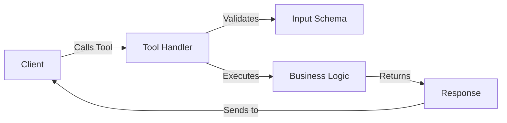

## What are Tools?

In MCP, **tools** are executable functions that servers expose to clients. They allow AI applications to perform actions like:

- Fetching data from external APIs
- Performing calculations
- Manipulating data
- Interacting with external systems
- Managing state (CRUD operations)

Tools are the primary way servers provide **active capabilities** to AI applications.

## Tool Anatomy

Every MCP tool consists of:

1. **Name** - Unique identifier for the tool
2. **Description** - Explains what the tool does (optional but recommended)
3. **Input Schema** - Defines expected parameters with validation
4. **Handler Function** - Implements the tool's logic



## Defining Tools in TypeScript

### Basic Tool Definition

From `source/servers/basic/src/server.ts:64-99`:

```typescript
server.tool(
  "get_random_quotes",  // Tool name
  { count: z.number().optional().default(5) },  // Input schema
  async ({ count }) => {  // Handler function
    try {
      // Validate count
      if (count <= 0) {
        return {
          content: [{ type: "text", text: "Count must be a positive number." }],
          isError: true
        };
      }
      if (count > 10) {
        return {
          content: [{ type: "text", text: "Maximum number of quotes is 10." }],
          isError: true
        };
      }

      // Fetch quotes from API
      const quotes = await fetchRandomQuotes(count);
      const formattedQuotes = quotes.map(formatQuote);

      return {
        content: [{ type: "text", text: formattedQuotes.join("\n---\n") }]
      };
    } catch (error) {
      return {
        content: [{ type: "text", text: `Error: ${(error as Error).message}` }],
        isError: true
      };
    }
  }
);
```

### Tool with Description

From `source/servers/basic/src/server.ts:102-125`:

```typescript
server.tool(
  "lcm",
  "Calculate the least common multiple of a list of numbers",  // Description
  { 
    numbers: z.array(z.number())
      .min(2)
      .describe("A list of numbers to calculate the least common multiple of. The list must contain at least two numbers.") 
  },
  async ({ numbers }) => {
    try {
      // Calculate LCM
      let result = Math.floor(numbers[0]);
      for (let i = 1; i < numbers.length; i++) {
        const num = Math.floor(numbers[i]);
        result = lcm(result, num);
      }

      return {
        content: [{ type: "text", text: `The least common multiple is: ${result}` }]
      };
    } catch (error) {
      return {
        content: [{ type: "text", text: `Error: ${(error as Error).message}` }],
        isError: true
      };
    }
  }
);
```

## Defining Tools in Python

### Using FastMCP Decorator

From `source/servers/calculator-py/server.py:19-30`:

```python
from mcp.server.fastmcp import FastMCP

mcp = FastMCP("Calculator MCP Server")

@mcp.tool()
def calculate(a: float, b: float, operation: str) -> float:
    """Perform a calculation with two numbers."""
    if operation == "add":
        return add(a, b)
    elif operation == "subtract":
        return subtract(a, b)
    elif operation == "multiply":
        return multiply(a, b)
    elif operation == "divide":
        return divide(a, b)
    else:
        raise ValueError("Operación no válida")
```

<Note>
  Python type hints are automatically converted to JSON schema for validation. The docstring becomes the tool description.
</Note>

## Real-World Tool Examples

### API Integration Tool

Fetching data from external APIs:

```typescript
const GOT_API_BASE = "https://api.gameofthronesquotes.xyz/v1";

async function fetchRandomQuotes(count: number): Promise<Quote[]> {
  if (count <= 0) {
    throw new Error("count must be a positive number");
  }
  if (count > 10) {
    throw new Error("maximum number of quotes is 10");
  }

  const url = `${GOT_API_BASE}/random/${count}`;
  const response = await fetch(url);

  if (!response.ok) {
    throw new Error(`Error fetching quotes: ${response.statusText}`);
  }

  return await response.json() as Quote[];
}
```

### Calculation Tool

From `source/servers/calculator-py/server.py:5-17`:

```python
def add(a: float, b: float) -> float:
    return float(a + b)

def subtract(a: float, b: float) -> float:
    return float(a - b)

def multiply(a: float, b: float) -> float:
    return float(a * b)

def divide(a: float, b: float) -> float:
    if b == 0:
        raise ValueError("No se puede dividir por cero")
    return float(a / b)
```

### CRUD Operations

From `source/servers/todo-ts/src/index.ts:15-97`:

```typescript
// Create
server.tool(
    "TODO-Create",
    "Create a new todo item",
    {
        task: z.string().describe("The task to add to the todo list"),
    },
    async ({task}) => {
        const todo = createTodo(task);
        return {
            content: [{
                type: "text",
                text: `Todo created: ${todo.task}`,
            }],
        };
    }
)

// Read
server.tool(
    "TODO-List",
    "List all todo items",
    {},
    async () => {
        const todos = getAllTodos();
        return {
            content: [{type: "text", text: JSON.stringify(todos, null, 2)}],
        };
    }
)

// Update
server.tool(
    "TODO-Update",
    "Update a todo item",
    {
        id: z.string().describe("The id of the todo item to update"),
        task: z.string().describe("The new task for the todo item"),
    },
    async ({id, task}) => {
        const todo = updateTodoTask(id, task);
        return {
            content: [{type: "text", text: `Todo updated: ${todo?.task}`}],
        };
    }
)

// Delete
server.tool(
    "TODO-Delete",
    "Delete a todo item",
    {
        id: z.string().describe("The id of the todo item to delete"),
    },
    async ({id}) => {
        const success = deleteTodo(id);
        return {
            content: [{type: "text", text: `Todo deleted: ${success ? "Success" : "Failed"}`}],
        };
    }
)
```

## Input Validation

### TypeScript with Zod

Zod provides powerful schema validation:

```typescript
import { z } from "zod";

server.tool(
  "advanced_search",
  {
    query: z.string().min(1).max(100),
    limit: z.number().int().positive().max(50).default(10),
    filters: z.object({
      category: z.enum(["fiction", "nonfiction", "science"]).optional(),
      minRating: z.number().min(0).max(5).optional(),
    }).optional(),
    sortBy: z.enum(["relevance", "date", "rating"]).default("relevance")
  },
  async ({ query, limit, filters, sortBy }) => {
    // All parameters are validated and typed
    // ...
  }
);
```

### Python Type Validation

```python
from typing import Literal, Optional
from pydantic import BaseModel, Field

class SearchFilters(BaseModel):
    category: Optional[Literal["fiction", "nonfiction", "science"]] = None
    min_rating: Optional[float] = Field(None, ge=0, le=5)

@mcp.tool()
def advanced_search(
    query: str = Field(..., min_length=1, max_length=100),
    limit: int = Field(10, gt=0, le=50),
    filters: Optional[SearchFilters] = None,
    sort_by: Literal["relevance", "date", "rating"] = "relevance"
) -> list:
    # All parameters are validated
    pass
```

## Response Format

All tool responses follow a standard format:

```typescript
return {
  content: [
    {
      type: "text",      // Content type (text, image, resource)
      text: "Result"     // The actual content
    }
  ],
  isError: false       // Optional error flag
};
```

### Success Response

```typescript
return {
  content: [{ 
    type: "text", 
    text: "Operation completed successfully" 
  }]
};
```

### Error Response

```typescript
return {
  content: [{ 
    type: "text", 
    text: "Error: Invalid parameter value" 
  }],
  isError: true
};
```

### Multiple Content Items

```typescript
return {
  content: [
    { type: "text", text: "Summary: Found 5 results" },
    { type: "text", text: JSON.stringify(results, null, 2) }
  ]
};
```

## Calling Tools from Clients

<CodeGroup>
```typescript TypeScript
const result = await client.callTool({
  name: "get_random_quotes",
  arguments: {
    count: 3
  }
});

console.log(result.content[0].text);
```

```python Python
result = await session.call_tool(
    "get_random_quotes",
    arguments={
        "count": 3
    }
)

print(result.content[0].text)
```
</CodeGroup>

## Best Practices

<AccordionGroup>
  <Accordion title="Validate All Inputs">
    Always validate inputs, even beyond schema validation:
    
    ```typescript
    async ({ count }) => {
      if (count <= 0) {
        return {
          content: [{ type: "text", text: "Count must be positive" }],
          isError: true
        };
      }
      // ... proceed with logic
    }
    ```
  </Accordion>
  
  <Accordion title="Use Descriptive Names">
    Tool names should clearly indicate their purpose:
    
    ```typescript
    // Good
    server.tool("get_random_quotes", ...)
    server.tool("calculate_lcm", ...)
    server.tool("TODO-Create", ...)
    
    // Bad
    server.tool("tool1", ...)
    server.tool("process", ...)
    ```
  </Accordion>
  
  <Accordion title="Handle Errors Gracefully">
    Catch errors and return helpful messages:
    
    ```typescript
    try {
      const result = await externalAPI.fetch();
      return { content: [{ type: "text", text: result }] };
    } catch (error) {
      return {
        content: [{ 
          type: "text", 
          text: `Failed to fetch data: ${error.message}` 
        }],
        isError: true
      };
    }
    ```
  </Accordion>
  
  <Accordion title="Add Descriptions and Schema Details">
    Help AI models understand how to use your tools:
    
    ```typescript
    server.tool(
      "search",
      "Search the database for matching records",
      {
        query: z.string().describe("The search query string"),
        limit: z.number().describe("Maximum number of results to return")
      },
      async ({ query, limit }) => { ... }
    );
    ```
  </Accordion>
  
  <Accordion title="Keep Tools Focused">
    Each tool should do one thing well:
    
    ```typescript
    // Good - Separate, focused tools
    server.tool("TODO-Create", ...)
    server.tool("TODO-List", ...)
    server.tool("TODO-Update", ...)
    
    // Bad - One tool doing everything
    server.tool("TODO-Manage", { action: z.enum([...]), ... }, ...)
    ```
  </Accordion>
</AccordionGroup>

<Warning>
  Tools execute with the same permissions as your server process. Be careful with tools that modify files, execute commands, or access sensitive data.
</Warning>

## Testing Tools

Test your tools before deploying:

```typescript
// Create a test client
const client = new Client(...);
await client.connect(transport);

// List available tools
const tools = await client.listTools();
console.log(tools);

// Test tool execution
const result = await client.callTool({
  name: "your_tool",
  arguments: { /* test data */ }
});

if (result.isError) {
  console.error("Tool failed:", result.content[0].text);
} else {
  console.log("Tool succeeded:", result.content[0].text);
}
```

## Next Steps

<CardGroup cols={2}>
  <Card title="Resources" icon="database" href="/concepts/resources">
    Learn how to provide data through resources
  </Card>
  
  <Card title="Prompts" icon="message" href="/concepts/prompts">
    Create reusable prompt templates for AI interactions
  </Card>
  
  <Card title="Servers" icon="server" href="/concepts/servers">
    Understand MCP server architecture
  </Card>
  
  <Card title="Clients" icon="laptop" href="/concepts/clients">
    Learn how clients consume tools
  </Card>
</CardGroup>