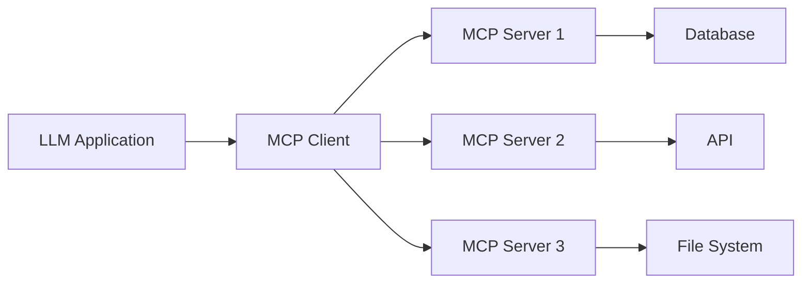

## What is the Model Context Protocol?

The **Model Context Protocol (MCP)** is an open protocol that standardizes how applications provide context to Large Language Models (LLMs). Think of it as a universal connector that allows LLMs to interact with external tools, data sources, and services in a consistent way.

<Note>
MCP was created by Anthropic and is designed to solve the fragmentation problem in LLM integrations. Instead of building custom integrations for each tool, MCP provides a single, standardized protocol.
</Note>

## Why MCP Matters

Large Language Models are powerful, but they have limitations:

- **No access to real-time data**: LLMs are trained on static datasets and can't fetch current information
- **No ability to take actions**: They can generate text but can't execute code, make API calls, or modify systems
- **Limited context**: They only know what's in their training data and your prompt

MCP solves these problems by providing a standardized way for LLMs to:

<CardGroup cols={2}>
  <Card title="Access Tools" icon="wrench">
    Execute functions and operations like calculations, API calls, or system commands
  </Card>
  <Card title="Read Resources" icon="database">
    Fetch data from external sources like databases, files, or APIs
  </Card>
  <Card title="Use Prompts" icon="message">
    Leverage pre-built prompt templates for common tasks
  </Card>
  <Card title="Maintain Context" icon="layer-group">
    Keep conversation context across multiple interactions
  </Card>
</CardGroup>

## How MCP Works

MCP uses a client-server architecture where:

1. **MCP Servers** expose capabilities (tools, resources, prompts) through the protocol
2. **MCP Clients** connect to servers and invoke these capabilities
3. **LLM Applications** use MCP clients to extend the LLM's capabilities



### Core Concepts

<AccordionGroup>
  <Accordion title="Tools" icon="screwdriver-wrench">
    Tools are functions that the LLM can invoke to perform operations. They define:
    - A unique name and description
    - Input parameters with validation schemas
    - The operation to execute when called
    
    Example: A calculator tool that performs mathematical operations.
  </Accordion>

  <Accordion title="Resources" icon="file">
    Resources represent data that can be read by the LLM. They can be:
    - Static resources with fixed URIs
    - Dynamic resources with templated URIs
    - Any data source: files, API responses, database records
    
    Example: A resource that fetches random quotes from an API.
  </Accordion>

  <Accordion title="Prompts" icon="sparkles">
    Prompts are reusable templates that help guide the LLM's responses. They include:
    - Structured messages with roles (system, user, assistant)
    - Parameterized content that can be customized
    - Context and instructions for specific tasks
    
    Example: A code review prompt that structures how to analyze code.
  </Accordion>

  <Accordion title="Transport" icon="network-wired">
    Transport defines how clients and servers communicate. MCP supports:
    - **stdio**: Communication through standard input/output (most common)
    - **HTTP with SSE**: Server-sent events for web applications
    - Custom transports for specific use cases
  </Accordion>
</AccordionGroup>

## What This Course Covers

This comprehensive course will teach you how to build production-ready MCP servers and clients through hands-on examples.

### Course Structure

<Steps>
  <Step title="Fundamentals">
    Learn the core MCP concepts, protocol details, and architecture patterns.
    
    - Protocol specification and message types
    - Client-server communication patterns
    - Tools, resources, and prompts in depth
  </Step>

  <Step title="Building Servers">
    Create MCP servers in TypeScript, Python, and Go with real-world examples.
    
    - Game of Thrones quotes API integration
    - Calculator with mathematical operations
    - Todo management with state
    - EDteam course API integration
  </Step>

  <Step title="Building Clients">
    Develop clients that connect to MCP servers and invoke their capabilities.
    
    - Basic clients in TypeScript and Python
    - Ollama integration for local LLM function calling
    - Error handling and connection management
  </Step>

  <Step title="Real-World Integration">
    Deploy and integrate MCP servers with popular LLM applications.
    
    - Claude Desktop integration
    - Custom LLM application integration
    - Production deployment patterns
  </Step>
</Steps>

### Code Examples

All examples in this course are real, working code from the [MCP Course repository](https://github.com/alexyslozada/mcp-course). You'll find implementations in:

- **TypeScript**: Using the official `@modelcontextprotocol/sdk`
- **Python**: Using both the official SDK and FastMCP
- **Go**: Using the `mark3labs/mcp-go` SDK

<CodeGroup>
```typescript TypeScript Server
import { McpServer } from "@modelcontextprotocol/sdk/server/mcp.js";
import { StdioServerTransport } from "@modelcontextprotocol/sdk/server/stdio.js";
import { z } from "zod";

const server = new McpServer({
  name: "Game of Thrones Quotes",
  version: "1.0.0",
  capabilities: {
    resources: { listChanged: true },
    tools: {},
    prompts: {}
  }
});

server.tool(
  "get_random_quotes",
  { count: z.number().optional().default(5) },
  async ({ count }) => {
    const quotes = await fetchRandomQuotes(count);
    return {
      content: [{ type: "text", text: formatQuotes(quotes) }]
    };
  }
);

const transport = new StdioServerTransport();
await server.connect(transport);
```

```python Python Server
from mcp.server.fastmcp import FastMCP

mcp = FastMCP("Calculator MCP Server")

@mcp.tool()
def calculate(a: float, b: float, operation: str) -> float:
    if operation == "add":
        return float(a + b)
    elif operation == "subtract":
        return float(a - b)
    elif operation == "multiply":
        return float(a * b)
    elif operation == "divide":
        if b == 0:
            raise ValueError("Cannot divide by zero")
        return float(a / b)
    else:
        raise ValueError("Invalid operation")

if __name__ == "__main__":
    mcp.run(transport='stdio')
```
</CodeGroup>

## Key Sections

Explore the course content:

<CardGroup cols={2}>
  <Card title="Quickstart" icon="rocket" href="/quickstart">
    Get your first MCP server running in 5 minutes
  </Card>
  
  <Card title="MCP Protocol" icon="book" href="/concepts/mcp-protocol">
    Deep dive into the protocol specification
  </Card>
  
  <Card title="Server Examples" icon="server" href="/servers/basic-typescript">
    Learn from working server implementations
  </Card>
  
  <Card title="Client Examples" icon="laptop-code" href="/clients/basic-typescript">
    Build clients that connect to MCP servers
  </Card>
</CardGroup>

## Prerequisites

To get the most out of this course, you should have:

- Basic understanding of programming concepts
- Familiarity with at least one of: TypeScript/JavaScript, Python, or Go
- Understanding of async/await patterns
- Basic knowledge of APIs and HTTP

<Tip>
Don't worry if you're not an expert! The course includes detailed explanations and real code examples you can follow along with.
</Tip>

## Next Steps

Ready to get started? Head to the [Quickstart Guide](/quickstart) to build your first MCP server, or explore the [MCP Protocol](/concepts/mcp-protocol) to understand the underlying concepts.

<Warning>
MCP is an evolving standard. This course uses MCP SDK version 1.7.0. Check the official [MCP documentation](https://modelcontextprotocol.io) for the latest updates.
</Warning>
